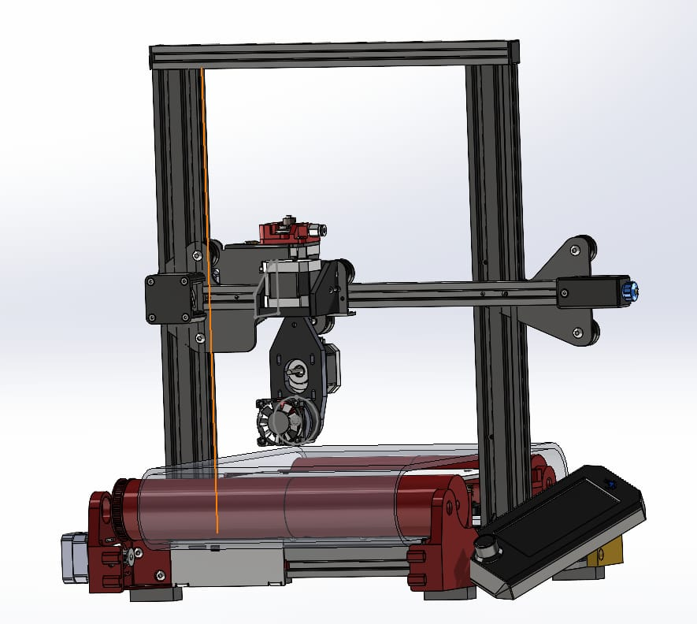

# Ender‑3 V2 → 5‑Axis Upgrade (Klipper + BTT Octopus v1.1)

> **Soon will be tested on:** Ender‑3 V2 frame with infinite Z axis, BigTreeTech **Octopus v1.1 (STM32F446ZET6)**, Raspberry Pi 4 Model B running **MainsailOS 1.1.1**

## Overview
This repository ships a ready‑to‑use **`printer.cfg`** and helper macros that transform a humble **Creality Ender‑3 / Ender‑3 V2** into a compact **5‑axis research platform with infinite Z axis for continous-uninterrupted manufacturing**. Two additional rotary axes **A & B** mount to the bed, enabling simultaneous 5‑axis toolpaths for CNC or experimental FFF printing—all driven by **Klipper** on an Octopus mainboard.



---

## Highlights
* Pin map matches the Octopus silkscreen (MOTOR_0‑MOTOR_4)  
* **TMC2209** drivers in UART mode, StealthChop disabled for repeatable torque  
* `MOVE_ROTATIONAL_AXES` macro for G‑code‑level A/B control  
* Mainsail UI presets (temperatures, graphs) via bundled `mainsail.cfg`  
* Fully commented for easy tuning—no “mystery values”  

---

## Bill‑of‑Materials (core items)
| Qty | Part | Notes |
|-----|------|-------|
| 1 | BigTreeTech **Octopus v1.1** | STM32F446ZET6 MCU, USB‑C |
| 5 | **TMC2209** drivers | X Y Z A B (add 6th for extruder if tool‑changer) |
| 2 | NEMA‑17 steppers | Recommended ≥ 400 cN·cm for A/B |
| 1 | Ender‑3 / V2 chassis | Remove stock mainboard |
| 1 | Raspberry Pi 3/4/5 | Runs Klipper + Moonraker + Mainsail |
| — | Misc. wiring, printed brackets | See `docs/` folder |

---

## Firmware Build & Flash (Octopus v1.1)
All compilation happens **on the Raspberry Pi that is already running MainsailOS**—no separate tool‑chain needed.

```bash
# 1  SSH into the Pi (default pw: raspberry)
ssh pi@mainsailos.local

# 2  Enter the Klipper source tree
cd ~/klipper

# 3  Configure build (one‑time)
make menuconfig
#  ───────────────────────────────────────────
#   Micro‑controller Architecture: STM32
#   Processor model: STM32F446
#   Bootloader offset: 32KiB
#   Clock reference: 12 MHz crystal
#   Communication interface: USB (onboard)
#  ───────────────────────────────────────────

# 4  Compile
make -j$(nproc)

# 5  Copy the result to a FAT‑formatted micro‑SD card
cp out/klipper.bin /media/$USER/<SD_NAME>/firmware.bin
```
1. **Power off** the printer, insert the card into the Octopus, then power on. The board will blink and rename the file to `FIRMWARE.CUR` when flashing completes.
2. After reboot, locate the MCU’s USB path with:
   ```bash
   ls /dev/serial/by-id/*
   ```
   Update the `serial:` line near the top of `printer.cfg` to match.

---

## Raspberry Pi / MainsailOS Setup
If you flashed the official **MainsailOS** image, Klipper, Moonraker and Mainsail are **already installed and enabled**—skip any extra installer scripts.

### First‑Boot Checklist
1. Download the latest **MainsailOS** image <https://github.com/mainsail‑os/>, flash it with *Raspberry Pi Imager* or *balenaEtcher*.
2. (Optional) Edit `mainsail-config.txt` on the boot partition to add Wi‑Fi SSID & password.
3. Boot the Pi; browse to **http://mainsailos.local** (or IP shown on HDMI).
4. Complete the on‑screen wizard: locale, webcam, MCU serial, user password.
5. Upload this repo’s `printer.cfg` via the **Configurator ➜ Settings > Printer Config** panel and *Restart Firmware*.

> Prefer a vanilla Raspberry Pi OS? Follow the [Raspberry Pi OS guide] instead or use **KIAUH**—the config files here remain unchanged.

---

## Configuration Files in this Repo
| File / Folder | Purpose |
|---------------|---------|
| `printer.cfg` | Main Octopus pin‑map & kinematics |
| `mainsail.cfg` | Dashboard presets (graphs, filament presets) |
| `macros/` | Helper macros (auto‑home, purge line, `MOVE_ROTATIONAL_AXES`) |
| `docs/` | STL brackets, wiring diagrams (coming soon) |

Copy the **whole folder** to `/home/pi/klipper_config/` (default path on MainsailOS) and restart Klipper:
```bash
sudo service klipper restart
```

---

## Wiring / Pin Map (excerpt)
| Axis | Octopus port | STEP | DIR | ENABLE | Comment |
|------|--------------|------|-----|--------|---------|
| X | MOTOR_0 | `PF13` | `PF12` | `!PG4` | GT2 20T |
| Y | MOTOR_1 | `PG0` | `PG1`  | `!PF15`| GT2 20T |
| Z | MOTOR_2 | `PF11`| `PG3`  | `!PG5` | Leadscrew |
| A | MOTOR_3 | `PG4` | `PC1`  | `!PA0` | Rotary |
| B | MOTOR_4 | `PF9` | `PF10` | `!PG2` | Rotary |

See `printer.cfg` for heaters, fans, end‑stops, and SPI/UART details.

---

## Calibration Steps
1. **Endstops:** `QUERY_ENDSTOPS` to verify triggered state.
2. **Steps per rev:** `rotation_distance` is preset for GT2/20T pulleys—adjust if yours differ.
3. **A/B Zero:** Physically zero rotaries and update `gcode_macro START_PRINT` offsets.
4. **PID:** `PID_CALIBRATE HEATER=extruder TARGET=210`, then `SAVE_CONFIG`.

---

## Usage Snippets
* Move rotary axes: `G0 A45 B‑30 F600`
* Helper macro: `MOVE_ROTATIONAL_AXES A=90 B=‑45`
* Slice with a post‑processing script that injects `A`/`B` moves, or hand‑code for testing.

---

## Safety Notice
Rapid 5‑axis moves can crash the tool into the bed or frame **very quickly**. Always begin with small angles and keep the e‑stop within reach. You assume all risk of damage or injury.

---

## Roadmap
- Fusion 360 / FreeCAD post‑processors
- Bed mesh aware of A/B tilt
- Sample 5‑axis demo prints

---


